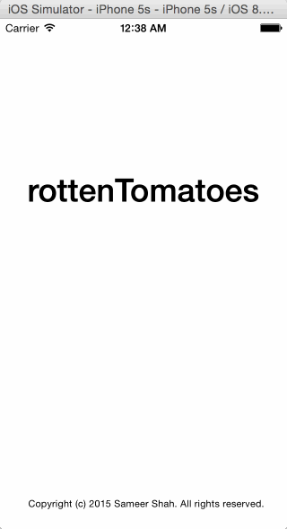
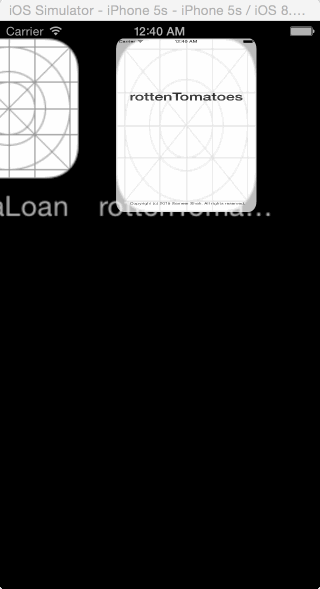

Rotten Tomatoes (raw)
This is a movies app displaying box office and top rental DVDs using the Rotten Tomatoes API.

Time spent: 6 hours

Features
Required

[ ] User can view a list of movies. Poster images load asynchronously.
[ ] User can view movie details by tapping on a cell.
[ ] User sees loading state while waiting for the API.
[ ] User sees error message when there is a network error: http://cl.ly/image/1l1L3M460c3C
[ ] User can pull to refresh the movie list.

Walkthrough

GIF created with [LiceCap](http://www.cockos.com/licecap/).

Credits
Rotten Tomatoes API
AFNetworking
